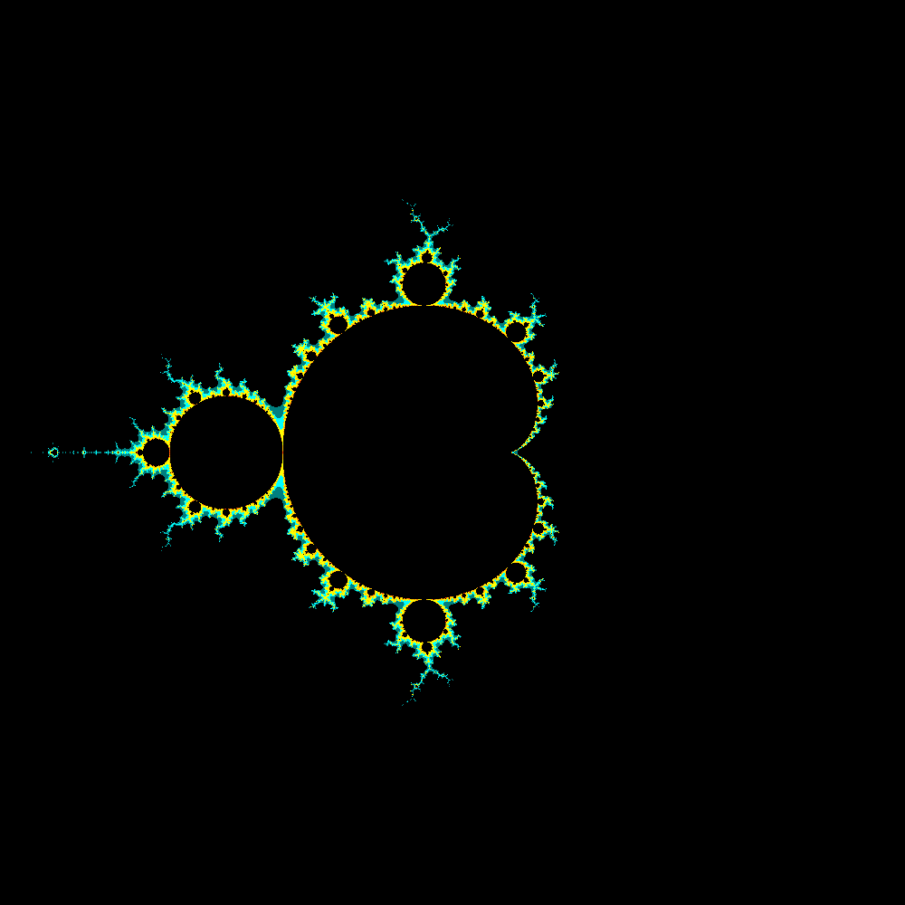
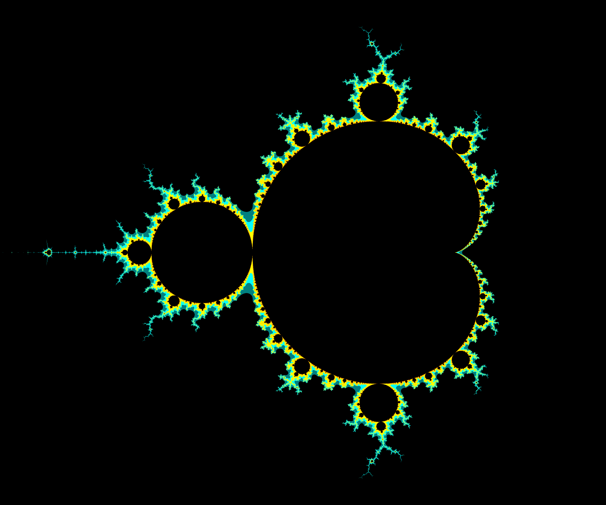
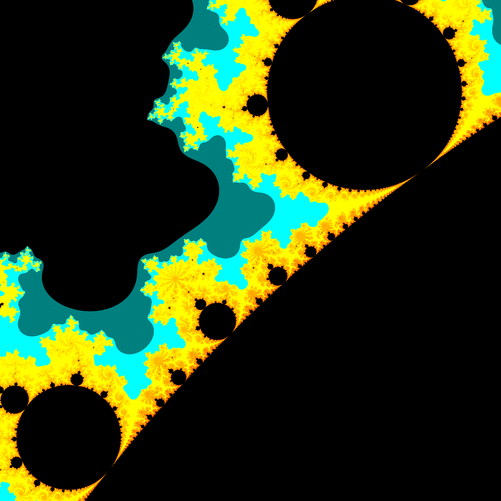

# Mandelbrot set Image Generator

A small program that generates a portion of the [Mandelbrot set](https://en.wikipedia.org/wiki/Mandelbrot_set).

Uses [ImageMagick](https://imagemagick.org/) to make the image, specifically its C++ API (Magick++). Also [enkiTS](https://github.com/dougbinks/enkiTS) to efficiently distribute the workload between threads.

If you don't have access to the Magick++ headers, there is a version that generates a text file for ImageMagick to read instead, on the `legacy` branch. It's really slow though.

## Prerequisites

You need to have ImageMagick installed on your system, and the Magick++ headers. Linux: `sudo apt install imagemagick libmagick++-dev`

Alternatively, you may use `graphicsmagick-libmagick-dev-compat` instead of `libmagick++-dev`. `libmagick++-dev` is *much* slower, because ImageMagick is slower than [GraphicsMagick](http://www.graphicsmagick.org/). If you do this, you need to change `MAGICK_FLAGS` in the Makefile to `-lMagick++`.

## Building (Linux)

Just run `make`.

* If you compiled ImageMagick from source, you'll probably have to change `MAGICK_FLAGS` in the Makefile to have the include directory and link the Magick++ library, because `pkg-config` might not be able to find it.
* If you are using Clang but encounter `/usr/bin/ld: cannot find -lomp: No such file or directory`, you're missing the OpenMP development package: `sudo apt install libomp-dev`. Clang was noticeably slower in my testing, so I recommend GCC.
* `-march=native` is enabled by default for all versions. Remove it from the Makefile if you don't want it.

Optionally, you can increase the color precision. Change `typedef uint8_t color_type;` to `typedef uint16_t color_type;` for 16-bit color. If you are making very zoomed-in images, you should probably find or make a better program because this is not very efficient for that use case, but if you want to use this one then you may have to change `typedef float c_float;` to `typedef double c_float;`. Also remove `-ffast-math` from the Makefile in case float precision is really an issue.

## Running (Linux)

`./mandelbrot.out <num_threads> <x_start> <x_end> <y_start> <y_end> <image_width> <image_height> <output_name> [<optional coloring file>]`

`x_start`, `x_end`, `y_start`, and `y_end` are the bounds on the Mandelbrot set that will be used in the image.

Included in this repository is the result of running `./mandelbrot.out <irrelevant> -2 2 -2 2 1000 1000 example1.png`, `./mandelbrot.out <irrelevant> -2 1 -1.25 1.25 3000 2500 example2.png`, and `./mandelbrot.out <irrelevant> -.65 -.45 .4 .6 2000 2000 example3.png` (see below).

Change the colors by editing the constants "near" the top of `main.cpp`, or by passing in a coloring file (see syntax below).

In my testing I discovered BMP images to be the fastest to make and AVIF to be the slowest. PNG tends to have smaller filesizes than JPG and WEBP for large blocks of colors, such as the default coloring provided.







## Optional Coloring File

The formatting is very simple: every line contains an integer for the iteration count followed by three floats (in range 0.0-1.0) for the color. The iteration count must go from smallest to largest for correct functionality.

```
<iteration> R G B
<iteration> R G B
<iteration> R G B
...
```

Example:

```
2 0.0 0.0 0.0
5 1.0 0.0 0.0
35 0.5 0.5 1.0
10000 1 1 1
```


# License

MIT

[enkiTS](https://github.com/dougbinks/enkiTS) license: zlib

# Acknowledgments

* StackOverflow
* the person I saw that did something very similar to this, but they printed colors in the terminal, and I wanted to do better by using ImageMagick
